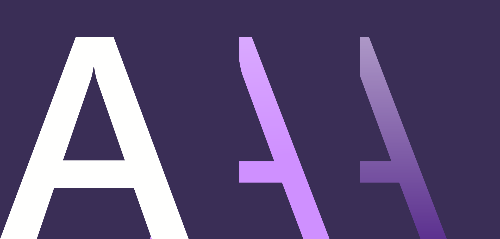

# Hub Page Example

:::row:::
    :::column:::
        
        ### [Chris](style.md)
        Chris provides intuitive wayfinding through an app's various levels of information and serves as a crucial tool for reinforcing the interaction model.
    :::column-end:::
    :::column:::
        
        ### [Hello there](style.md)
       blah!! As the visual representation of language, typography’s main task is to be clear. Its style should never get in the way of that goal. The following guidelines focus on how to use typography to help users understand content easily.
    :::column-end:::
:::row-end:::

:::row:::
    :::column:::
        
        ### [Chris](style.md)
        Chris provides intuitive wayfinding through an app's various levels of information and serves as a crucial tool for reinforcing the interaction model.
    :::column-end:::
    :::column:::
        
        ### [Hello there](style.md)
       blah!! As the visual representation of language, typography’s main task is to be clear. Its style should never get in the way of that goal. The following guidelines focus on how to use typography to help users understand content easily.
    :::column-end:::
:::row-end:::