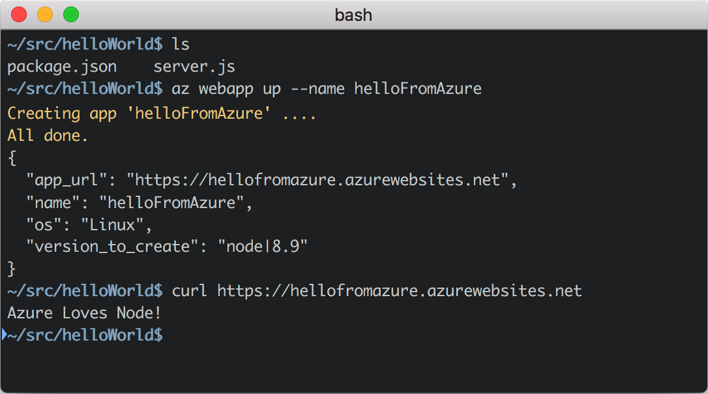

# Hub Page Example

:::row:::
    :::column:::
        ### [Node.js Deployment to the Cloud](style.md)
        **Deploy**, **manage**, and **scale** your Node.js applications in minutes.

        [Get Started Now](https://code.visualstudio.com/tryappservice)
        [Read the Docs](https://docs.microsoft.com/nodejs)
    :::column-end:::
    :::column:::
        
    :::column-end:::
:::row-end:::

:::row:::
    :::column:::
        
        ### Azure CLI
    :::column-end:::
    :::column:::
        
        ### Azure App Service
    :::column-end:::
    <!-- :::column:::
        
        ### Docker
    :::column-end::: -->
    :::column:::
        
        ### MongoDB Redis SQL
    :::column-end:::
    :::column:::
        
        ### Azure DevOps
    :::column-end:::
:::row-end:::

:::row:::
    :::column:::
        ### Linux based Web Apps that scale.
        Leave the infrastructure, scaling and availability up to Azure App Services while you focus on building your app with support for containers, staging, rollback, and testing-in-production.
    :::column-end:::
    :::column:::
        
    :::column-end:::
:::row-end:::

:::row:::
    :::column:::
        
    :::column-end:::
    :::column:::
        ### Global scale NoSQL databases, **zero code changes**.
        Let Azure DocumentDB host your MongoDB database in the cloud and enjoy a 99.99% SLA on consistency, latency, throughput, and availability, all without changing a single line of code.
    :::column-end:::
:::row-end:::

:::row:::
    :::column:::
        ### Complete **DevOps** in a single command.
        With one command, set up continuous integration and deployment from your local or cloud hosted repository, giving you the confidence to check in early and often.
    :::column-end:::
    :::column:::
        
    :::column-end:::
:::row-end:::

:::row:::
    :::column:::
        ### Node.js Deployment with VS Code and Azure.
        [Get Started Now](https://code.visualstudio.com/tryappservice)
    :::column-end:::
:::row-end:::